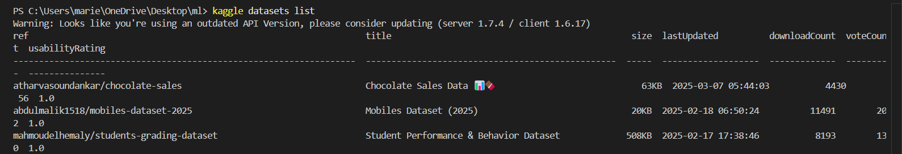
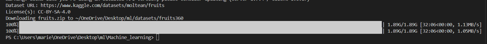

# Fruits-360 Dataset Setup Guide

## 📌 How to Replicate This Setup

This guide will help you download and set up the **Fruits-360 dataset** using Kaggle's API. 

---

## ✅ **Step 1: Install Kaggle CLI**
First, you need to install Kaggle in your Python environment:

```bash
pip install kaggle
```

---

## ✅ **Step 2: Get Your Kaggle API Token**
1. Go to [Kaggle](https://www.kaggle.com/).
2. Click on your **profile picture** (top-right corner).
3. Go to **Account Settings**.
4. Scroll down to the **API** section and click **Create New API Token**.
5. This will download a file called **`kaggle.json`**.

---

## ✅ **Step 3: Move `kaggle.json` to the Correct Location**
Now, move `kaggle.json` to the required directory so that the Kaggle CLI can use it:

```bash
mkdir -p ~/.kaggle
mv ~/Downloads/kaggle.json ~/.kaggle/
chmod 600 ~/.kaggle/kaggle.json
```

---

## 🤔 **Why Are We Doing This?**
We're moving `kaggle.json` to `~/.kaggle/` because the Kaggle CLI **needs it to authenticate**. Without it, Kaggle won’t allow us to download datasets. The `chmod 600` command ensures that **only you can access the file**, keeping your API credentials secure.

---

## ✅ **Step 4: Verify Kaggle CLI is Working**
To confirm everything is set up correctly, run:

```bash
kaggle datasets list
```

If it worked, you should see a list of available datasets similar to this:



---

## ✅ **Step 5: Download the Fruits-360 Dataset**
Now, download the dataset to your preferred location:

```bash
kaggle datasets download moltean/fruits -p fruits360
unzip fruits360/fruits.zip -d fruits360

```
---



## ✅ **Step 6: Select Only 10 Categories**
Run `categories.py` so that only the selected **10 categories** are copied into a new folder:

```bash
python categories.py
```

---
Now your dataset only has **10 categories instead of the full dataset**.
